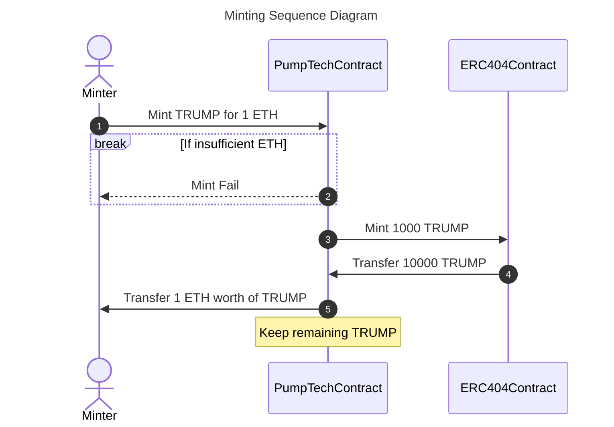
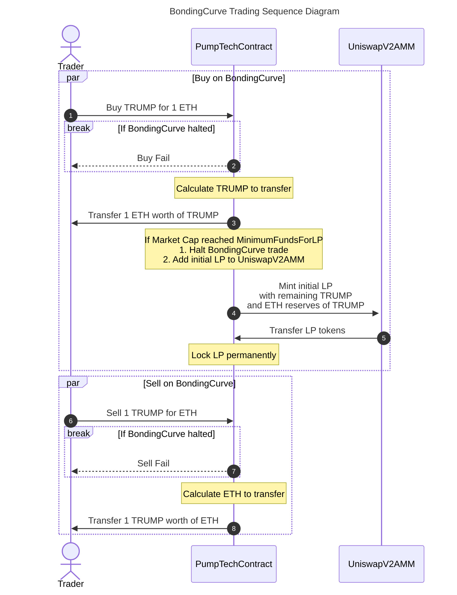
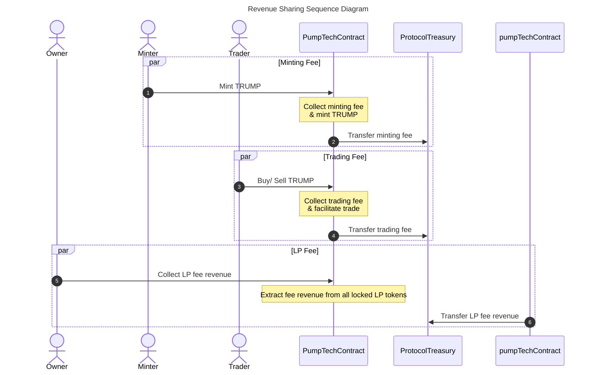

# Operations

## Minting
 - The MaxSupply of all ERC404 tokens mint by `PumpTechContract` is a constant (Let's say, `10000`)
 - To mint a new ERC404 token, the `Minter` must pay ETH to `PumpTechContract`
 - `PumpTechContract` mints whole `MaxSupply` of ERC404 tokens, and transfer a certain amount of it to `Minter`
 - This amount is calculated based on the amount of ETH paid by `Minter`, after deducting a `MintFee` set by the protocol
 - If the amount of ETH paid by `Minter` is insufficient, the minting process fails
 - Bancor's Power formula is used to calculate the amount of ERC404 tokens to be transferred to `Minter`
 - The remaining ERC404 tokens are kept by `PumpTechContract` for enabling trading

## Trading
The ERC404 tokens mint by this protocol are traded on either of the following AMM:

1. BondingCurve
2. UniswapV2

The ERC404 tokens mint by `PumpTechContract` are traded on `PumpTechContract` initially, until it's Market Cap (in ETH) reaches `MinimumFundsForLP` threshold set by the protocol. After that, the remaining ERC404 tokens in `PumpTechContract` are paired with ETH collected from sales on BondingCurve to create `UniswapV2LP` tokens. These LP tokens are used for further trading on a UniswapV2 AMM. Also, these initial LP tokens are locked permanently in `PumpTechContract` to ensure base liquidity of the ERC404 token.

### BondingCurve
The buying process on BondingCurve is as follows:
 - The `Trader` pays ETH to `PumpTechContract` to buy ERC404 tokens
 - If the BondingCurve is halted, the buying process fails
 - The amount of ERC404 tokens to be transferred to `Trader` is calculated based on the amount of ETH paid by `Trader` using Bancor's Power formula
 - If the Market Cap of `PumpTechContract` reaches `MinimumFundsForLP`, the BondingCurve trading is halted and the initial LP tokens are added to UniswapV2AMM
 - Similarly, when selling ERC404 tokens on BondingCurve, the amount of ETH to be transferred to `Trader` is calculated based on the amount of ERC404 tokens paid by `Trader` using Bancor's Power formula
 - If the BondingCurve is halted, the selling process fails

## Revenue Sharing
The `PumpTechContract` collects fees from minting and trading operations. It also allows extracting fees accumulated from locked LP tokens. The minting and trading fees are transferred to the `ProtocolTreasury` contract during the minting and trading operations. The protocol owner can extract the LP fees from the locked LP tokens at any time, while the initial LP amount shall remain locked.

